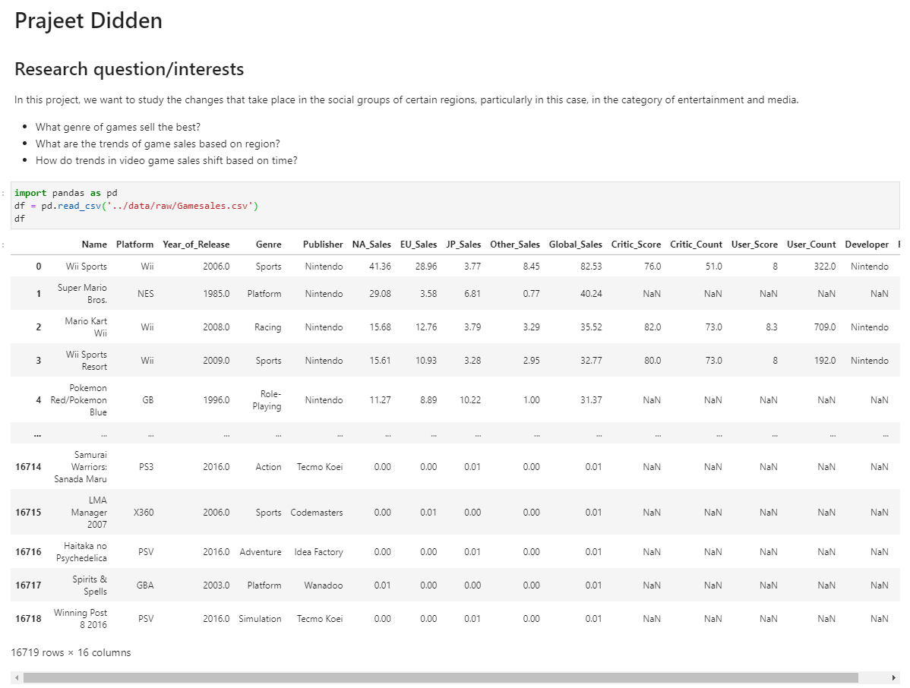

# Group 123 - Game Dataset Project

- Your title can change over time.

## Milestones

Details for Milestone are available on Canvas (left sidebar, Course Project) or [here](https://firas.moosvi.com/courses/data301/project/milestone01.html).

## Describe your topic/interest in about 150-200 words

> In this project, we want to study the changes that take place in the social groups of certain regions, particularly in this case, in the category of entertainment and media. As such, we are interested in what type of genre of games sell the best in the different regions, according to the different years. By studying this topic, we want to analyse the various trends that take place in the regions included in the dataset (i.e. North America, European Union, and Japan) and see if these trends change completely or remain almost the same across time. It would be interesting to display the findings made in a data dashboard since it could allow for a better understanding of recreation preferences human groups have over time and, more importantly, understand the broader society in which theses preferences exist.

## Describe your dataset in about 150-200 words

> This dataset shows video game sales with ratings. The dataset is merged by two data provided by VGChartz and Metacritic. It has a game name, console on which the game is running, the year of the game released, genre, publisher, and game sales in North America, European Union, Japan and the rest of countries, total sales in the world. It also contains critic score (aggregate score compiled by Metacritic staff), critic count (the number of critics used in coming up with the Criticscore), user score ( score by Metacritic's subscribers ), user count (number of users who gave the userscore), developer (party responsible for creating the game), and rating from ESRB ratings. This dataset was created in 2016. The purpose of this dataset is to see machine learning techniques and visualize the continued data. The data was generated by web scrapes.

## Team Members

- Person 1: I'm a COSC major!
- Person 2: one sentence about you!
- Person 3: one sentence about you!

## Images

# Milestone 2 
> 

## References

https://www.kaggle.com/rush4ratio/video-game-sales-with-ratings

Video Link:
https://www.youtube.com/watch?v=FCWWJjUmT4M 

